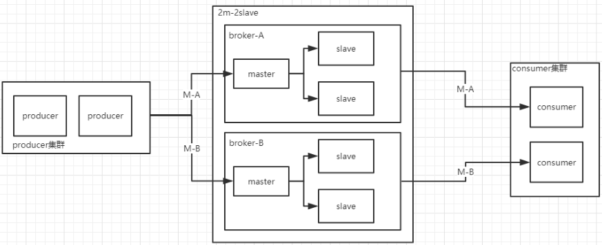

### rocketmq ###

### 现象描述 ###

```
  消息broker默认生成4条队列， 有序模式会一次性拉去4个队列， 同时有序模式抛出异常后会马上消费，且不会修改消费次数；
  mq消息默认次数超过16次后，消息会进入死信队列
```

### 消费模型比较： kafka、rocketmq ###

推模式
```
broker主动推消息给消费者，来一条推一条

优点：来一条推一条，实时性较高

缺点：消费者的消费能力有限，如果一时间大量的消息推过来 消费者并没有能力一下去消费这么多。不同的消费者消费速率可能不同，导致broker维护不同消费者推送速率较困难.

适用于： 消息量不大，消息实时性要求高场景
```
 

拉模式
```
消费者主动的去broker拉消息，消费者可根据自己的消费能力去拉消息

优点：broker只需要存储好生产者发来的数据，具体谁来拉 什么时候拉都不用管了。可以支持批量拉取，消费者根据自身条件选择批量拉取 

缺点：消息延迟，消费者可能两秒发一次请求向broker拉数据(不能过于频繁)。 消息忙请求(可能连续拉了几个小时一条消息都没有，做无用功)
```
 

总结
```
RocketMQ 和 Kafka 都选择了拉模式，当然业界也有基于推模式的消息队列如 ActiveMQ

消费者各种各样，身为 Broker 不应该有依赖于消费者的倾向，而是主要负责存储消息，方便消费者自己来拉消息。

RocketMQ 和 Kafka 都是利用“长轮询”来实现拉模式，
```

###ＦＱＡ ###

```
1、线程和queue的关系
2、mq获取消息后，如何调用


一个consumer订阅多个queue,并更新Namesrv路由表信息
```


### 可用性 ###
```
https://blog.csdn.net/LinYaoGai/article/details/77876078

由于消息分布在各个broker上，一旦某个broker宕机，则该broker上的消息读写都会受到影响。所以rocketmq提供了master/slave的结构，salve定时从master同步数据，如果master宕机，则slave提供消费服务，但是不能写入消息，此过程对应用透明，由rocketmq内部解决。
这里有两个关键点：
一旦某个broker master宕机，生产者和消费者多久才能发现？受限于rocketmq的网络连接机制，默认情况下，最多需要30秒，但这个时间可由应用设定参数来缩短时间。这个时间段内，发往该broker的消息都是失败的，而且该broker的消息无法消费，因为此时消费者不知道该broker已经挂掉。
消费者得到master宕机通知后，转向slave消费，但是slave不能保证master的消息100%都同步过来了，因此会有少量的消息丢失。但是消息最终不会丢的，一旦master恢复，未同步过去的消息会被消费掉。
```

### kafka & rocket类似 ###

 


### 分享核心 ###

https://zhuanlan.zhihu.com/p/83505477

 


消费者实例侧由于可能同时负责消费多个 MessageQueue，因此采用了线程池消费消息，需要在客户端提供加锁的方式保证单个 MessageQueue 内的消息同一时间仅被一个线程消费。

高可用保证：




LevelDb源码分析：
https://github.com/balloonwj/CppGuide/tree/master/articles/leveldb%E6%BA%90%E7%A0%81%E5%88%86%E6%9E%90

http://balloonwj.gitee.io/cpp-guide-web/articles/leveldb%E6%BA%90%E7%A0%81%E5%88%86%E6%9E%90/leveldb%E6%BA%90%E7%A0%81%E5%88%86%E6%9E%901.html

https://www.zhihu.com/column/codeit